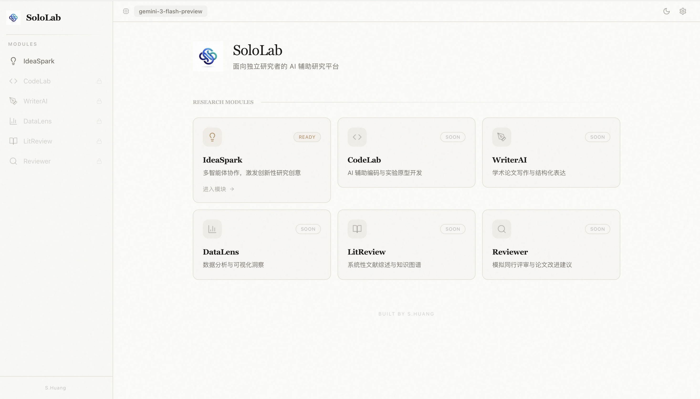
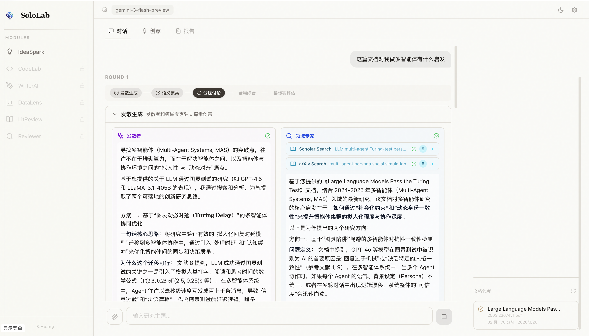
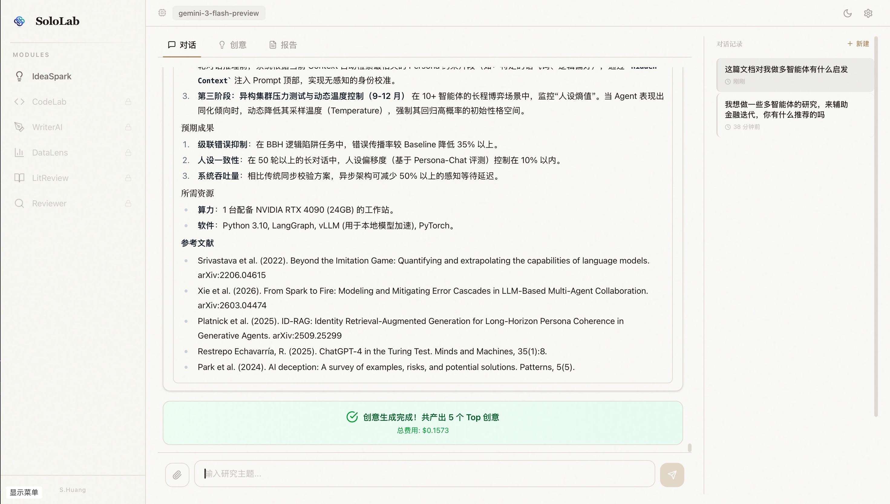
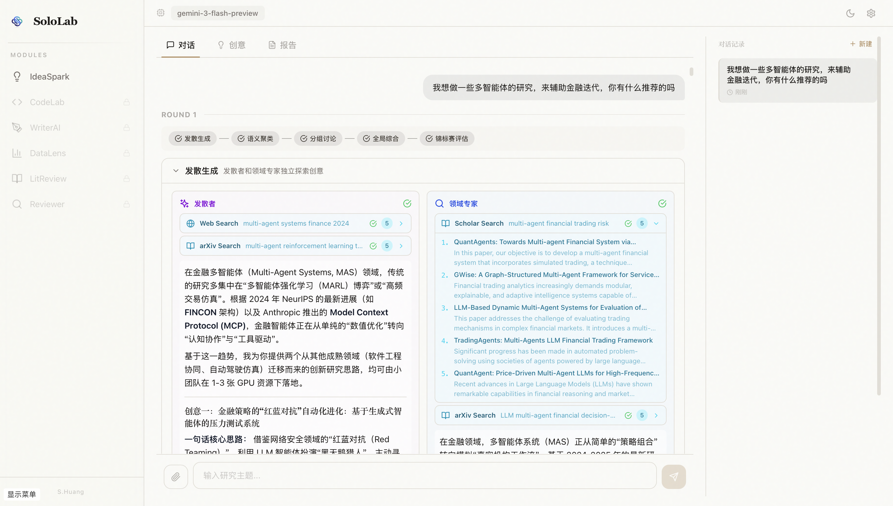
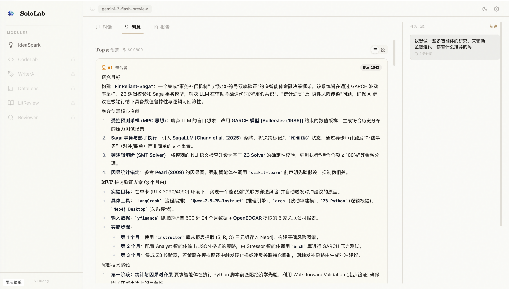
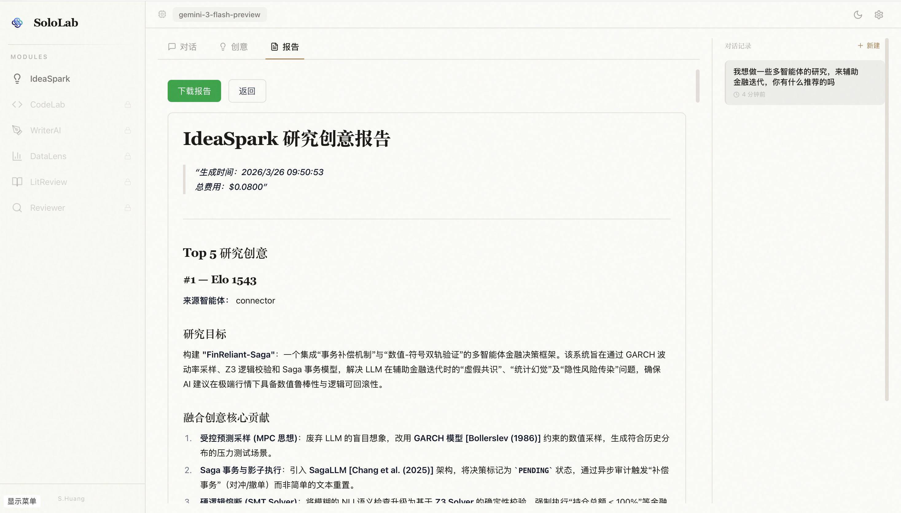
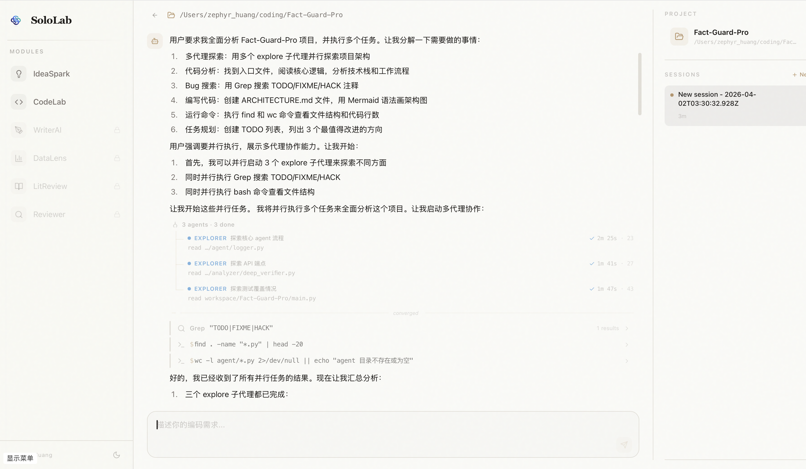
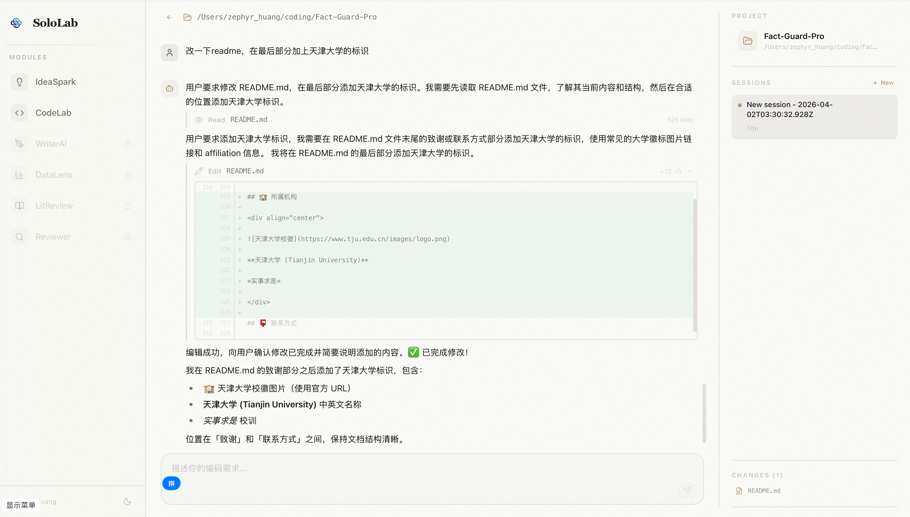
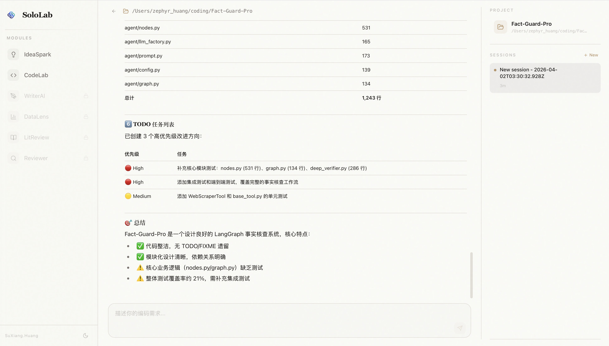

<div align="center">


# SoloLab

### One-Person Lab, Infinite Minds

**面向独立研究者的全栈 AI 辅助研究平台**

*将完整的科研工作流封装为可热插拔的智能模块，一个人也能拥有一支研究团队*

<p>
<a href="https://python.org"></a>
<a href="https://fastapi.tiangolo.com"></a>
<a href="https://nextjs.org"></a>
<a href="https://postgresql.org"></a>
<a href="https://redis.io"></a>
<a href="https://docker.com"></a>

</p>

<p>
<a href="#overview">平台概览</a> ·
<a href="#modules">模块路线图</a> ·
<a href="#architecture">系统架构</a> ·
<a href="#ideaspark">IdeaSpark</a> ·
<a href="#codelab">CodeLab</a> ·
<a href="#benchmark">Benchmark</a> ·
<a href="#quickstart">快速开始</a> ·
<a href="#dev-module">开发新模块</a>
</p>

</div>

<div align="center">

<br/>
<sub>统一工作台：模块切换 · 对话流 · Agent 活动时间线 · 研究结果沉淀</sub>
</div>

---

<a id="overview"></a>

## 🔭 What is SoloLab?

SoloLab（一人实验室）是一个**模块化的 AI 研究平台**，将独立研究者的完整工作流，从灵感涌现到论文写作，封装为可热插拔的功能模块，通过统一架构编排。

<!-- 📌 图片占位符 ① — 平台总览概念图
     建议内容：展示 SoloLab 三层架构（前端模块 → 核心服务层 → 数据层）和六大模块的关系
     推荐工具：Excalidraw / draw.io / Figma
     尺寸建议：1200×600px，浅色背景，导出 PNG
-->
<div align="center">

<br/>
<sub>平台总览：前端模块层 · 核心服务层 · 数据与记忆层</sub>
</div>

### 🎯 设计哲学

<center>
<table align="center" width="960" cellpadding="12">
<tr>
<td align="center" width="20%" valign="top">
<h4>🔌</h4>
<b>模块热插拔</b><br/>
<sub>每个模块独立运行<br/>零耦合、即插即用</sub>
</td>
<td align="center" width="20%" valign="top">
<h4>🌐</h4>
<b>模型无关</b><br/>
<sub>OpenAI 兼容网关<br/>支持 100+ 模型</sub>
</td>
<td align="center" width="20%" valign="top">
<h4>🔍</h4>
<b>透明可控</b><br/>
<sub>每步 Prompt 可见<br/>Token 费用追踪</sub>
</td>
<td align="center" width="20%" valign="top">
<h4>🐳</h4>
<b>一键部署</b><br/>
<sub>Docker Compose<br/>单人可运维</sub>
</td>
<td align="center" width="20%" valign="top">
<h4>🔄</h4>
<b>断点恢复</b><br/>
<sub>长任务可恢复<br/>不丢失状态</sub>
</td>
</tr>
</table>
</center>

---

<a id="modules"></a>

## 🗺️ 模块路线图

SoloLab 的核心价值在于**统一架构承载多个研究阶段的智能模块**。每个模块独立开发、独立部署、即插即用：

<center>
<table align="center" width="960" cellpadding="10">
<tr>
<th align="center">模块</th>
<th align="center">功能</th>
<th align="center">状态</th>
</tr>
<tr>
<td align="center">💡 <b>IdeaSpark</b></td>
<td>多智能体创意涌现 · Separate-Together · Elo 锦标赛</td>
<td align="center"></td>
</tr>
<tr>
<td align="center">🔧 <b>CodeLab</b></td>
<td>AI 编码助手 · 多代理并行探索 · 工具调用链 · 文件读写与终端</td>
<td align="center"></td>
</tr>
<tr>
<td align="center">✍️ <b>WriterAI</b></td>
<td>学术论文写作 · 大纲生成 · 段落润色</td>
<td align="center"></td>
</tr>
<tr>
<td align="center">📊 <b>DataLens</b></td>
<td>数据分析 · 可视化生成 · 统计检验</td>
<td align="center"></td>
</tr>
<tr>
<td align="center">📚 <b>LitReview</b></td>
<td>系统性文献综述 · 引用图谱 · 研究趋势</td>
<td align="center"></td>
</tr>
<tr>
<td align="center">🔍 <b>Reviewer</b></td>
<td>模拟审稿人 · 批判性审查 · 改进建议</td>
<td align="center"></td>
</tr>
</table>
</center>

---

<a id="architecture"></a>

## 🏗️ 系统架构

<!-- 📌 图片占位符 ⑥ — 系统技术架构图
     建议内容：三层架构图
       顶层：Frontend (Next.js 14) — Module Shell / SSE Renderer / Zustand
       中层：API Gateway (FastAPI) — 9 个核心服务模块（LLM Gateway, Module Registry, Tool Registry, Memory Manager, Session Manager, Task State Manager, Prompt Manager, Document Pipeline, Cost Tracker）
       底层：Data Layer — PostgreSQL+pgvector / Redis / File Storage
       连接线标注：REST + SSE (Last-Event-ID)
     推荐工具：Excalidraw / draw.io / Figma
     尺寸建议：1200×700px，浅色背景
-->
<div align="center">

<br/>
<sub>前端工作台 · FastAPI 核心服务 · PostgreSQL / Redis / 文件存储</sub>
</div>

### 核心服务

<center>
<table align="center" width="960" cellpadding="16">
<tr>
<td width="50%" valign="top">
<b>🧠 LLM Gateway</b><br/>
<sub>OpenAI 兼容格式，支持 100+ 模型</sub><br/>
<sub>内置降级链与模型 Fallback</sub><br/>
<sub>实时费用追踪与预算控制</sub>
<br/><br/>
<b>📦 Module Registry</b><br/>
<sub>基于 <code>manifest.json</code> 的热插拔</sub><br/>
<sub><code>ModuleBase</code> 抽象类 + 标准生命周期</sub><br/>
<sub>动态加载/卸载，零停机</sub>
<br/><br/>
<b>🔧 Tool Registry</b><br/>
<sub>统一 <code>ToolBase</code> 接口封装</sub><br/>
<sub>arXiv / Semantic Scholar / Tavily / PDF</sub><br/>
<sub>自动限速与结果缓存</sub>
</td>
<td width="50%" valign="top">
<b>💾 Memory Manager</b><br/>
<sub>pgvector 向量检索 + 4 级作用域</sub><br/>
<sub>Module → Session → Project → Global</sub><br/>
<sub>跨模块知识传递</sub>
<br/><br/>
<b>⏱️ Task State Manager</b><br/>
<sub>Redis Stream 持久化每个 SSE 事件</sub><br/>
<sub>递增 <code>event_id</code> 支持断线恢复</sub><br/>
<sub>24h 任务状态保留</sub>
<br/><br/>
<b>📄 Document Pipeline</b><br/>
<sub>PyMuPDF 学术 PDF 高精度解析</sub><br/>
<sub>语义分块（500~1500 tokens）</sub><br/>
<sub>自动元数据提取与向量存储</sub>
</td>
</tr>
</table>
</center>

---

<a id="showcase"></a>

## 📂 平台能力展示

### 文档上传与解析

支持上传学术 PDF，通过 PyMuPDF 引擎高精度解析双栏排版、LaTeX 公式和表格，自动语义分块后存入向量数据库，供智能体深度检索：

<!-- 📌 图片占位符 ⑦ — 文档上传截图
     截图内容：文档上传界面 + 上传后的解析状态/已上传文档列表
     重点展示：上传区域、解析进度条/状态标签、已解析文档列表、分块数量等
     截图时机：上传一篇 PDF 后，显示解析完成状态
-->
<div align="center">

<br/>
<sub>上传学术 PDF → PyMuPDF 高精度解析 → 语义分块 → 向量化存储 → 供智能体检索</sub>
</div>

### 会话与历史管理

所有对话和运行结果持久化存储，支持会话切换、历史回溯和跨模块上下文传递：

<!-- 📌 图片占位符 ⑧ — 会话历史管理截图
     截图内容：侧边栏的会话列表 或 历史记录管理页面
     重点展示：多个会话条目、时间戳、模块标签、会话切换交互
     截图时机：有多个历史会话时的侧边栏/管理界面
-->
<div align="center">

<br/>
<sub>会话持久化 · 历史回溯 · 跨模块上下文传递</sub>
</div>

---

<a id="ideaspark"></a>

## 💡 IdeaSpark — 首个模块

> **多智能体创意涌现系统**：5 个差异化智能体 × Separate-Together 协作 × 实时文献检索 × Elo 锦标赛排序

<center>
<table align="center" width="960" cellpadding="12">
<tr>
<td align="center" width="25%">
<b>5 个角色智能体</b><br/>
<sub>差异化分工，独立发散后再协同收敛</sub>
</td>
<td align="center" width="25%">
<b>28 次工具调用 / run</b><br/>
<sub>实时搜索与文献验证，保证创意可追溯</sub>
</td>
<td align="center" width="25%">
<b>56 次受控实验</b><br/>
<sub>逐组件量化多智能体系统的真实收益</sub>
</td>
<td align="center" width="25%">
<b>$0.028 / run</b><br/>
<sub>帕累托最优配置成本</sub>
</td>
</tr>
</table>
</center>

### 🧬 The Problem

<center>
<table align="center" width="960" cellpadding="0" cellspacing="0">
<tr>
<td width="50%" valign="top">
科研工作中，<b>idea 的产生</b> 是最具挑战性的环节。<br/><br/>

传统头脑风暴依赖多人协作，但独立研究者缺乏多样化的认知碰撞环境。大语言模型（LLM）虽然强大，但单一模型的输出容易陷入 <b>单一视角</b> 和 <b>知识截止日期</b> 的限制。<br/><br/>

<em>"我一个人做科研，最缺的不是写代码的能力，而是一个能跟我争论、质疑、补充的'虚拟同事'。"</em><br/>
<em>— 一位独立研究者</em>
</td>
<td width="50%" valign="top">

<!-- 📌 图片占位符 ⓪ — Problem 对比图
     内容：左右对比或上下对比，传统方式 vs SoloLab 方式
     左/上：研究者 → 单 LLM → 泛泛之谈（没有文献、没有审辩、没有验证、没有迭代）
     右/下：研究者 → 5 个智能体 → 并行发散 × 工具搜索 × 分组讨论 × 锦标赛 → 高质量方案
-->


</td>
</tr>
</table>
</center>

IdeaSpark 将一个研究主题转化为经过 **多轮辩论、文献检索验证和锦标赛排序** 的高质量研究创意。

### 🤖 五大角色智能体

<center>
<table align="center" width="960" cellpadding="12">
<tr>
<td align="center" width="20%" valign="top">
<h3>🌀</h3>
<b>发散者</b><br/>
<sub>Divergent Thinker</sub><br/><br/>
<code>temp: 1.0</code><br/>
<sub>跨领域类比<br/>大胆联想</sub><br/><br/>
<sub>🔧 web_search<br/>🔧 arxiv_search</sub>
</td>
<td align="center" width="20%" valign="top">
<h3>🎓</h3>
<b>领域专家</b><br/>
<sub>Domain Expert</sub><br/><br/>
<code>temp: 0.5</code><br/>
<sub>深度专业知识<br/>方法论审查</sub><br/><br/>
<sub>🔧 arxiv_search<br/>🔧 scholar_search<br/>🔧 doc_parse</sub>
</td>
<td align="center" width="20%" valign="top">
<h3>⚔️</h3>
<b>审辩者</b><br/>
<sub>Critic</sub><br/><br/>
<code>temp: 0.3</code><br/>
<sub>挑战假设<br/>寻找漏洞</sub><br/><br/>
<sub>🔧 arxiv_search</sub>
</td>
<td align="center" width="20%" valign="top">
<h3>🔗</h3>
<b>连接者</b><br/>
<sub>Connector</sub><br/><br/>
<code>temp: 0.7</code><br/>
<sub>发现关联<br/>组合融合</sub><br/><br/>
<sub>—</sub>
</td>
<td align="center" width="20%" valign="top">
<h3>⚖️</h3>
<b>评估者</b><br/>
<sub>Evaluator</sub><br/><br/>
<code>temp: 0.3</code><br/>
<sub>锦标赛投票<br/>Elo 排序</sub><br/><br/>
<sub>—</sub>
</td>
</tr>
</table>
</center>

### 🔄 Separate → Together 协作流程

<!-- 📌 图片占位符 ② — Separate-Together 流程图
     建议内容：纵向流程图，展示 7 个阶段：
       用户输入 → Separate(发散者+专家并行) → 语义聚类 → Together(分组碰撞) → 全局整合 → Elo锦标赛 → 收敛检查(循环/输出)
     重点标注：每个阶段的角色、工具调用、信息流向
     推荐工具：Excalidraw / Figma / draw.io
     尺寸建议：800×1200px 或 1200×800px（横/竖均可），浅色背景
-->
<div align="center">

<br/>
<sub>从并行发散到分组碰撞，再到全局整合与 Elo 排序</sub>
</div>

### 🖥️ 运行实况

输入一个研究主题后，5 个智能体开始并行工作，实时展示每个 Agent 的思考过程、工具调用和创意产出：

<!-- 📌 图片占位符 ③ — IdeaSpark 运行中截图
     截图内容：IdeaSpark 模块运行时的界面
     重点展示：左侧对话区 + 右侧 Agent 活动时间线（显示发散者/专家正在工作、工具调用滚动、阶段进度）
     截图时机：运行过程中（Separate 或 Together 阶段）
-->
<div align="center">

<br/>
<sub>智能体并行工作中：左侧对话流 · 右侧 Agent 活动时间线 · 实时工具调用</sub>
</div>

经过多轮协作和 Elo 锦标赛排序后，系统输出 Top-5 创意卡片，每张包含完整的方案描述、文献引用和可行性分析：

<!-- 📌 图片占位符 ④ — 创意看板截图
     截图内容：IdeaSpark 运行完成后的创意卡片列表
     重点展示：Top-5 创意排名、Elo 分数、Agent 来源标签、Markdown 渲染的创意内容
     截图时机：一次完整运行结束后
-->
<div align="center">

<br/>
<sub>Top-5 创意看板：Elo 评分排序 · Agent 来源标注 · 完整文献引用</sub>
</div>

运行完成后，可一键生成结构化的 Markdown 研究报告，包含所有创意的详细描述和方法论分析：

<!-- 📌 图片占位符 ⑤ — 最终报告截图
     截图内容：导出的 Markdown 报告渲染页面 或 报告下载界面
     重点展示：结构化的研究创意报告（标题、摘要、方法论、参考文献）
     截图时机：点击"生成报告"按钮后
-->
<div align="center">

<br/>
<sub>一键生成 Markdown 研究报告：方法论描述 · 参考文献 · 可直接导出</sub>
</div>

### 🔧 实时工具调用

系统运行时，智能体自主调用外部 API 获取前沿信息，确保每个创意都有据可查：

<center>
<table align="center" width="960" cellpadding="12">
<tr>
<td align="center" width="25%" valign="top">
<h4>📄 arXiv</h4>
<sub>预印本论文搜索<br/>获取最新学术成果<br/><b>~19 次/run</b></sub>
</td>
<td align="center" width="25%" valign="top">
<h4>🔗 Semantic Scholar</h4>
<sub>引用图谱 + 论文元数据<br/>验证研究脉络<br/><b>~4 次/run</b></sub>
</td>
<td align="center" width="25%" valign="top">
<h4>🌐 Tavily Search</h4>
<sub>实时网络搜索<br/>行业趋势与应用<br/><b>~5 次/run</b></sub>
</td>
<td align="center" width="25%" valign="top">
<h4>📑 PDF Parser</h4>
<sub>学术 PDF 全文解析<br/>提取实验细节<br/><b>按需调用</b></sub>
</td>
</tr>
</table>
</center>

> 每次运行平均 **28 次工具调用**，确保 100% 的创意具有真实文献支撑（Grounding Rate = 100%）。

---

<a id="benchmark"></a>

## 📊 Benchmark：56 次消融实验的量化验证

> 💡 *"多智能体比单 LLM 好"是被广泛接受的直觉，但真的如此吗？我们用 56 次受控实验来回答。*

我们设计了 **7 种消融条件 × 4 个跨学科主题 × 2 次重复 = 56 次受控运行**，配合 LLM-as-Judge 五维度评审（560 次评分），逐组件拆解了系统中每个部分的真实贡献。

### 核心发现

<center>
<table align="center" width="960" cellpadding="10">
<tr>
<th align="center">条件</th>
<th align="center">Overall</th>
<th align="center">Grounding</th>
<th align="center">Cost</th>
<th align="center">Latency</th>
</tr>
<tr>
<td align="center">🏆 <b>Full System</b></td>
<td align="center"><b>8.53 ± 0.07</b></td>
<td align="center">✅ 100%</td>
<td align="center">$0.080</td>
<td align="center">493s</td>
</tr>
<tr>
<td align="center">1️⃣ <b>SingleRound</b> ⬅ 帕累托最优</td>
<td align="center"><b>8.45 ± 0.11</b></td>
<td align="center">✅ 100%</td>
<td align="center"><b>$0.028</b></td>
<td align="center"><b>110s</b></td>
</tr>
<tr>
<td align="center">🚫🔍 NoTools</td>
<td align="center">6.21 ± 3.83</td>
<td align="center">❌ 0%</td>
<td align="center">$0.032</td>
<td align="center">597s</td>
</tr>
<tr>
<td align="center">💬 Baseline (单 LLM)</td>
<td align="center">5.53 ± 0.43</td>
<td align="center">❌ 0%</td>
<td align="center">$0.005</td>
<td align="center">18s</td>
</tr>
</table>
</center>

<div align="center">
<pre>
📊 组件贡献归因

🤖 多智能体框架    ████████████████████████████  +54%
🔍 工具调用(搜索)  ██████████████████           +37%
🏅 Elo 锦标赛      █                            +1.4%
🔄 多轮迭代        █                            +0.9%
👨‍⚖️ Critic 审辩     ▏                            +0.1%
</pre>
</div>

> **90% 以上的质量提升来自"多智能体框架 + 工具调用"。** SingleRound 配置用 1/4 时间、1/3 成本达到 99% 质量，是当前最优的效率-质量平衡点。

<p align="center">
📖 <b><a href="docs/benchmark/ideaspark-ablation.md">查看完整消融实验报告 →</a></b><br/>
<sub>含实验设计、逐层分析、三种假说与复现指南</sub>
</p>

---

<a id="codelab"></a>

## 🔧 CodeLab — AI 编码助手

> **一句话描述**：把 AI Coding Agent 搬进浏览器 — 多代理并行探索 × 20+ 工具自主编排 × 内联 Diff 预览 × 跨会话记忆

<center>
<table align="center" width="960" cellpadding="12">
<tr>
<td align="center" width="25%">
<b>3 类专用代理</b><br/>
<sub>Build / Explore / Plan<br/>意图路由，各司其职</sub>
</td>
<td align="center" width="25%">
<b>20+ 内置工具</b><br/>
<sub>Read / Edit / Grep / Bash / Web<br/>Agent 自主编排调用</sub>
</td>
<td align="center" width="25%">
<b>并行子代理</b><br/>
<sub>Task 工具 spawn 多个 explore<br/>独立上下文同时深入</sub>
</td>
<td align="center" width="25%">
<b>3 变量直连 100+ LLM</b><br/>
<sub>MODEL / KEY / URL<br/>改 .env 即切换 Provider</sub>
</td>
</tr>
</table>
</center>

### 🧠 The Design

<center>
<table align="center" width="960" cellpadding="0" cellspacing="0">
<tr>
<td width="50%" valign="top">
独立研究者写代码时，最缺的不是 IDE 插件，而是一个<b>能理解整个项目、自主调查并动手修改</b>的助手。<br/><br/>

市面上的 AI 编码工具要么只能补全当前行（Copilot），要么需要独立客户端（Cursor/Claude Code）。<br/><br/>

CodeLab 基于优秀的开源项目 <a href="https://github.com/nicepkg/opencode"><b>OpenCode</b></a>（MIT License）构建。在 OpenCode 强大的 Agent 引擎之上，SoloLab 进行了深度改造与扩展，将其集成为一站式 Web 编码模块：<b>打开浏览器就是完整的 Coding Agent</b>。<br/><br/>

<em>"给它一句话，它会派出 3 个探索代理并行调查代码，汇聚结果后自己写代码、跑测试、给你看 diff。"</em>
</td>
<td width="50%" valign="top">

<!-- 📌 图片 CL-① — CodeLab 概念图
     内容：左右对比，展示传统编码方式 vs CodeLab 方式
     左：开发者 → IDE 插件 → 单行补全（局部视角，不了解项目全貌）
     右：开发者 → CodeLab → 3 个 Agent 并行（Explore 架构 + Explore 测试 + Build 实现）→ 自主读写文件 + 运行命令 → diff 交付
     风格：与 IdeaSpark 的 problem-comparison.png 保持一致
     尺寸：600×400px
-->


</td>
</tr>
</table>
</center>

### 🤖 三大 Agent 类型

<center>
<table align="center" width="960" cellpadding="12">
<tr>
<td align="center" width="33%" valign="top">
<h3>🏗️</h3>
<b>Build Agent</b><br/>
<sub>编码执行者</sub><br/><br/>
<sub>读取代码 → 分析 → 编辑文件<br/>运行命令 → 验证结果<br/>写测试 → 提交变更</sub><br/><br/>
<sub>🔧 Read / Edit / Write / Bash<br/>🔧 Glob / Grep / Web</sub>
</td>
<td align="center" width="33%" valign="top">
<h3>🔍</h3>
<b>Explore Agent</b><br/>
<sub>代码探索者</sub><br/><br/>
<sub>只读模式，极速搜索<br/>映射架构 · 追踪依赖<br/>2-3 个并行同时工作</sub><br/><br/>
<sub>🔧 Read / Glob / Grep<br/>🔧 Bash (只读)</sub>
</td>
<td align="center" width="33%" valign="top">
<h3>📋</h3>
<b>Plan Agent</b><br/>
<sub>方案规划者</sub><br/><br/>
<sub>分析需求 → 设计方案<br/>识别关键文件 · 权衡取舍<br/>输出实施计划后移交 Build</sub><br/><br/>
<sub>🔧 Read / Glob / Grep<br/>📄 结构化计划输出</sub>
</td>
</tr>
</table>
</center>

### 🖥️ 运行实况

输入任务后，Agent 自动规划执行策略，复杂任务会 spawn 多个子代理并行探索：

<!-- 📌 图片 CL-② — 多代理并行探索
     截图内容：CodeLab 界面，显示 3 个并行 explore 子代理已完成
     重点展示：
       - 左侧：Agent 的任务规划文本 + "3 agents · 3 done" 状态栏
       - 中间：3 个 EXPLORER 卡片（分别探索不同方向，显示耗时和工具调用数）
       - 右侧：Session 侧边栏 + CHANGES 文件列表
     截图时机：多代理探索完成后的结果汇总页面
     参考：你之前测试的第一张截图就是完美素材
-->
<div align="center">

<br/>
<sub>3 个 explore 子代理并行调查 · 独立上下文 · 结果自动汇聚</sub>
</div>

Agent 完成分析后，自主读取文件、编辑代码、运行验证命令。所有工具调用实时可见，Edit 操作自动展开 Diff 预览：

<!-- 📌 图片 CL-③ — 工具调用 + Diff 预览
     截图内容：CodeLab 界面，显示 Agent 的工具调用链
     重点展示：
       - Read 工具卡片（显示文件名 + 行数）
       - Edit 工具卡片（自动展开，显示红绿色 inline diff）
       - Bash 工具卡片（显示命令 + 输出）
       - 左侧边框的 warm 色脉搏动画（如果能截到 running 状态更好）
     截图时机：Agent 执行 Edit 后 diff 自动展开的瞬间
-->
<div align="center">

<br/>
<sub>工具调用实时展示 · Edit 自动展开 Diff · Bash 命令输出内联</sub>
</div>

完成后，右侧面板显示所有修改的文件，会话自动保存到历史记录：

<!-- 📌 图片 CL-④ — 会话完成 + 侧边栏
     截图内容：CodeLab 界面完成态
     重点展示：
       - 左侧：Agent 的最终总结文本
       - 右上：项目名 + 目录路径
       - 右中：Session 历史列表（显示标题 + 时间）
       - 右下：CHANGES 文件列表（ARCHITECTURE.md / README.md 等）
     截图时机：一次完整对话结束后
-->
<div align="center">

<br/>
<sub>会话自动持久化 · 修改文件追踪 · Session 历史即时同步</sub>
</div>

### 🔧 20+ 内置工具

Agent 运行时自主编排调用，无需人工指定：

<center>
<table align="center" width="960" cellpadding="12">
<tr>
<td align="center" width="25%" valign="top">
<h4>📂 文件操作</h4>
<sub>Read · Edit · Write · MultiEdit<br/>Glob · Grep · Ls<br/><b>内联 Diff 自动展开</b></sub>
</td>
<td align="center" width="25%" valign="top">
<h4>💻 终端与执行</h4>
<sub>Bash · ApplyPatch<br/>支持任意 shell 命令<br/><b>输出内联渲染</b></sub>
</td>
<td align="center" width="25%" valign="top">
<h4>🌐 Web 与搜索</h4>
<sub>WebFetch · WebSearch<br/>获取文档与 API 参考<br/><b>实时网络访问</b></sub>
</td>
<td align="center" width="25%" valign="top">
<h4>🧠 规划与记忆</h4>
<sub>Task · TodoWrite · Plan<br/>Memory · Question<br/><b>跨会话知识积累</b></sub>
</td>
</tr>
</table>
</center>

### 🏛️ 技术架构

<!-- 📌 图片 CL-⑤ — CodeLab 技术架构图
     内容：三层架构图，展示数据流向
       顶层：Browser (Next.js)
         - SSE Stream 直连 OpenCode（虚线箭头，标注"实时流式"）
         - REST API 连 SoloLab Backend（实线箭头，标注"Session CRUD"）
       中层（双服务）：
         - SoloLab Backend (FastAPI) — Session 代理 · PostgreSQL
         - OpenCode Server (Bun + Hono) — Agent · Tool · LLM · SQLite
       底层：
         - Vercel AI SDK → 100+ LLM Providers（Anthropic / OpenAI / 通义 / DeepSeek / ...）
       重点标注：".env 三变量直连" 从底层 LLM 到 OpenCode
     风格：与 architecture.png 保持一致的视觉风格
     尺寸：1200×600px
-->
<div align="center">

<br/>
<sub>Frontend ←→ Backend (Session 代理) ←→ OpenCode Engine ←→ 100+ LLM via Vercel AI SDK</sub>
</div>

> **极简 Provider 接入**：`.env` 设置 `CODELAB_MODEL` / `CODELAB_API_KEY` / `CODELAB_BASE_URL` 三个变量即可切换任意 LLM。无注册表、无 models.dev 网络依赖、无配置文件。Anthropic / OpenAI / Google 原生 SDK 自动检测，其他 Provider 走 OpenAI Compatible。

### 🙏 致敬 OpenCode

CodeLab 的核心引擎基于 **[OpenCode](https://github.com/nicepkg/opencode)**（MIT License）构建。OpenCode 提供了卓越的 Agent 框架、工具系统、会话管理和 MCP 协议支持，是 CodeLab 得以实现的基石。

**SoloLab 在 OpenCode 基础上的改造与扩展：**

<center>
<table align="center" width="960" cellpadding="10">
<tr>
<th align="center">维度</th>
<th align="center">OpenCode 原有能力</th>
<th align="center">SoloLab CodeLab 扩展</th>
</tr>
<tr>
<td align="center">🏗️ 部署形态</td>
<td>独立 CLI / TUI 终端应用</td>
<td><b>Web 一站式平台模块</b>，浏览器直接使用</td>
</tr>
<tr>
<td align="center">🤖 多代理</td>
<td>单 Agent + 子任务</td>
<td><b>意图路由 + 并行子代理</b>，自动 spawn 2-3 个 explore 同时调查</td>
</tr>
<tr>
<td align="center">📝 提示词</td>
<td>英文提示词系统</td>
<td><b>基于 Claude Code 深度优化的中文提示词</b>，Task 工具触发引导增强</td>
</tr>
<tr>
<td align="center">⚙️ 模型配置</td>
<td>40+ Provider 聚合 + models.dev 网络依赖</td>
<td><b>3 个 .env 变量直连</b>，移除 1200 行聚合层，零网络依赖</td>
</tr>
<tr>
<td align="center">💾 会话管理</td>
<td>独立 SQLite 会话</td>
<td><b>Frontend→Backend→OpenCode 单向代理</b>，PG+SQLite 统一，级联删除</td>
</tr>
<tr>
<td align="center">🎨 前端</td>
<td>终端 TUI (Solid.js)</td>
<td><b>Next.js Web UI</b>，Warm Stone 设计体系，工具调用光效，Diff 自动展开</td>
</tr>
<tr>
<td align="center">🗜️ 上下文</td>
<td>基础 Compaction</td>
<td><b>三级 Compaction</b>（L1 裁剪 / L2 启发式 / L3 LLM 摘要）+ 自适应 Prompt Cache</td>
</tr>
</table>
</center>

> 感谢 OpenCode 团队的开源贡献。CodeLab 的所有改造代码遵循 Apache 2.0 许可证发布。

---

## 🛠️ 技术栈

<p align="center">
<b>Backend</b>&nbsp;&nbsp;


<br/>
<b>Frontend</b>&nbsp;&nbsp;


<br/>
<b>CodeLab Engine</b>&nbsp;&nbsp;


<br/>
<b>AI / Search</b>&nbsp;&nbsp;


<br/>
<b>Infra</b>&nbsp;&nbsp;


</p>

---

<a id="quickstart"></a>

## 🚀 快速开始

### 前置条件

- [Docker](https://docs.docker.com/get-docker/) & Docker Compose

> 仅需 Docker，无需手动安装 Python、Node.js、PostgreSQL 或 Redis。

### 一键部署

```bash
git clone https://github.com/huangsuxiang/sololab.git && cd sololab
cp .env.example .env   # 编辑 .env 填入你的 LLM API Key
docker compose up -d   # 🚀 一行拉起全部 5 个服务
```

启动后自动完成：PostgreSQL + pgvector 初始化 → Redis 就绪 → **数据库表自动迁移** → Backend 启动 → Frontend 就绪 → Caddy 反向代理。

| 入口 | 地址 |
|------|------|
| 前端界面 | http://localhost:3000 |
| API 文档 | http://localhost:8000/docs |
| 反向代理 (HTTPS) | https://localhost |

### `.env` 必填项

```bash
# IdeaSpark 模块
IDEASPARK_BASE_URL=https://api.openai.com/v1  # OpenAI 兼容端点
IDEASPARK_API_KEY=sk-xxx
IDEASPARK_MODEL=gpt-4o

# CodeLab 模块（3 变量直连 AI SDK）
CODELAB_MODEL=anthropic/claude-sonnet-4-5     # providerID/modelID
CODELAB_API_KEY=sk-xxx
# CODELAB_BASE_URL=                           # anthropic/openai/google 无需设置

# 外部 API
TAVILY_API_KEY=tvly-xxx                       # Tavily 搜索（https://tavily.com）
EMBEDDING_API_KEY=sk-xxx                      # 向量嵌入（可与 IdeaSpark 相同）
```

> 详见 [.env.example](.env.example)，含 30+ Provider 配置示例。

### 本地开发

本地开发仍需要数据库服务。推荐用 Docker 单独启动基础设施：

```bash
# 仅启动 PostgreSQL + Redis
docker compose up -d postgres redis

# 后端（新终端）
conda activate sololab  # 或使用你偏好的虚拟环境
cd backend && pip install -e ".[dev]"
alembic upgrade head    # 初始化数据库表
uvicorn sololab.main:app --reload --port 8000

# 前端（新终端）
cd frontend && pnpm install && pnpm dev
```

### 运行测试

```bash
conda activate sololab
pytest tests/unit/ -v          # 单元测试
pytest tests/integration/ -v   # 集成测试
```

> 📂 Benchmark 复现指南见 [消融实验报告](docs/benchmark/ideaspark-ablation.md#-复现指南)。

---

## 📁 项目结构

```text
soloLab/
├── backend/                       # FastAPI 后端
│   └── src/sololab/
│       ├── main.py                # 应用入口
│       ├── config/                # 配置 & LLM 配置
│       ├── core/                  # 核心服务层 (7 个服务)
│       ├── api/                   # REST API 路由 (含 codelab.py 代理)
│       ├── models/                # Pydantic 数据模型
│       ├── modules/               # 可插拔功能模块
│       │   └── ideaspark/         # IdeaSpark 模块
│       ├── tools/                 # 外部工具 (arXiv/Scholar/Tavily)
│       └── benchmark/             # Benchmark 评测框架
│
├── opencode/                      # CodeLab 引擎 (OpenCode 核心)
│   ├── packages/opencode/src/     # 核心源码 (45 子模块)
│   │   ├── agent/                 # Agent 定义 (build/explore/plan)
│   │   ├── session/               # 会话 + Compaction + 记忆
│   │   ├── provider/              # LLM Provider (直连 Vercel AI SDK)
│   │   ├── tool/                  # 20+ 工具 (read/edit/bash/grep...)
│   │   └── server/                # Hono HTTP/WebSocket
│   └── opencode.jsonc             # 引擎配置
│
├── frontend/                      # Next.js 14 前端
│   └── src/
│       ├── app/                   # App Router 页面
│       ├── components/            # UI 组件库 (含 modules/codelab/)
│       ├── lib/                   # API Client & OpenCode Client
│       ├── stores/                # Zustand 状态管理
│       └── types/                 # TypeScript 类型定义
│
├── tests/                         # 测试 (unit/integration/e2e)
├── docs/                          # 架构文档 & PRD
├── infra/                         # Dockerfiles & Caddyfile
└── docker-compose.yml             # 一键部署 (6 服务: PG + Redis + OpenCode + Backend + Frontend + Caddy)
```

---

<a id="dev-module"></a>

## 🧑‍💻 开发新模块

SoloLab 采用 **manifest + ABC 抽象类** 的插件架构。新模块不需要修改任何核心代码，不需要注册路由，不需要手动接线——放入目录即刻生效。

### 架构优势

<center>
<table align="center" width="960" cellpadding="12">
<tr>
<td align="center" width="25%" valign="top">
<h4>📁</h4>
<b>零配置发现</b><br/>
<sub>放入 <code>modules/</code> 目录<br/>自动扫描 <code>manifest.json</code><br/>启动即加载</sub>
</td>
<td align="center" width="25%" valign="top">
<h4>💉</h4>
<b>全服务注入</b><br/>
<sub>LLM · 工具 · 记忆 · 文档<br/>通过 <code>ModuleContext</code><br/>一次注入，开箱即用</sub>
</td>
<td align="center" width="25%" valign="top">
<h4>🔌</h4>
<b>运行时热插拔</b><br/>
<sub>加载/卸载零停机<br/><code>on_load</code> / <code>on_unload</code><br/>完整生命周期钩子</sub>
</td>
<td align="center" width="25%" valign="top">
<h4>🌊</h4>
<b>原生流式输出</b><br/>
<sub><code>execute()</code> 即 AsyncGenerator<br/>天然支持 SSE 推送<br/>前端零适配</sub>
</td>
</tr>
</table>
</center>

### 三步创建新模块

**1. 声明 `manifest.json`** — 描述模块元数据与依赖

```json
{
  "id": "your-module",
  "name": "YourModule",
  "version": "0.1.0",
  "description": "Module description",
  "icon": "Sparkles",
  "entry_point": "sololab.modules.your_module.module:YourModule",
  "required_tools": ["web_search", "arxiv_search"],
  "required_models": ["reasoning"],
  "config_schema": {
    "type": "object",
    "properties": {
      "max_rounds": { "type": "integer", "default": 3 }
    }
  }
}
```

**2. 实现 `ModuleBase`** — 只需两个方法

```python
class YourModule(ModuleBase):
    def manifest(self) -> ModuleManifest:
        return load_from_json("modules/your-module/manifest.json")

    async def execute(self, request: ModuleRequest, ctx: ModuleContext) -> AsyncGenerator:
        # ctx 自动注入所有核心服务：
        #   ctx.llm_gateway        — 100+ 模型，一行调用
        #   ctx.tool_registry      — arXiv/Scholar/Tavily/PDF
        #   ctx.memory_manager     — 向量记忆检索
        #   ctx.task_state_manager — SSE 事件持久化
        #   ctx.document_pipeline  — PDF 解析与分块
        response = await ctx.llm_gateway.generate(...)
        yield TextChunk(content=response)
```

**3. 放入 `modules/` 目录** — 自动发现、热加载、即刻可用

```text
backend/src/sololab/modules/
├── ideaspark/          # ✅ 已有模块
│   ├── manifest.json
│   └── module.py
└── your-module/        # 🆕 你的新模块
    ├── manifest.json
    └── module.py
```

> 无需修改 `main.py`、无需注册路由、无需重启服务。`ModuleRegistry.discover_modules()` 在启动时自动扫描，运行时可通过 API 动态加载/卸载。

---

<div align="center">

## 📜 License & Author

<p>
<b>License:</b> Apache License 2.0
<br/>
<b>Author:</b> Suxiang Huang
<br/>
📧 huangsuxiang5@gmail.com
<br/>
💬 WeChat: 13976457218
<br/>
🏛️ Memory and Reasoning Lab, Tianjin University
</p>

<hr/>

<sub>
<b>SoloLab</b> · <i>One-Person Lab, Infinite Minds</i><br/>
Built for independent researchers who refuse to let team size limit their ambitions.
</sub>

</div>
